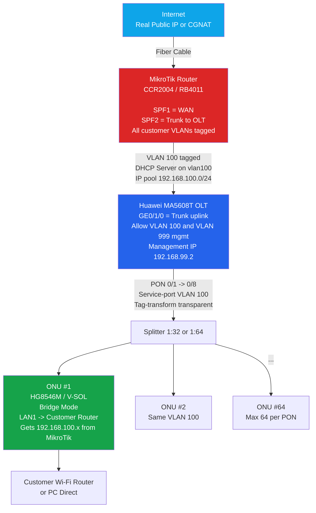

# Huawei OLT Configuration Guide for GPON FTTH with MikroTik
Based on your previous setup (MikroTik as core router with VLAN-per-customer for PPPoE billing), here's a complete guide for Huawei OLT integration. This focuses on the popular MA5608T model (most common in Cambodia for small/medium ISPs in 2025, ~$800–$1,200 USD). It supports up to 8 PON ports (512 ONUs per port, total ~4,000 customers).
Huawei OLTs are reliable for GPON but more complex than BDCOM—use CLI (Telnet/Console) or U2000 NMS for management. Default login: root/admin or root/admin123. Connect via console (9600 baud) initially.

## Features
- **Simple Queue + Queue Tree:** Limit speed per customer exactly (10/10, 20/5, 50/50 Mbps…)
- **Universal Queue (PCQ):** Fair sharing when line is full → no one hogs all bandwidth
- **Cake Queue (RouterOS 7.13+):** YBest for bufferbloat, very smooth Zoom/YouTube even on full line
- **ScalabPPPoE + MikroTik APIility:**  Connect to local billing software (CamISP, MikroBill, etc.)
- **Torch & Packet Sniffer:**  Find who downloads torrent 24h very fast
- **VLAN per customer**  No broadcast storm, very secure

## Works Flow

